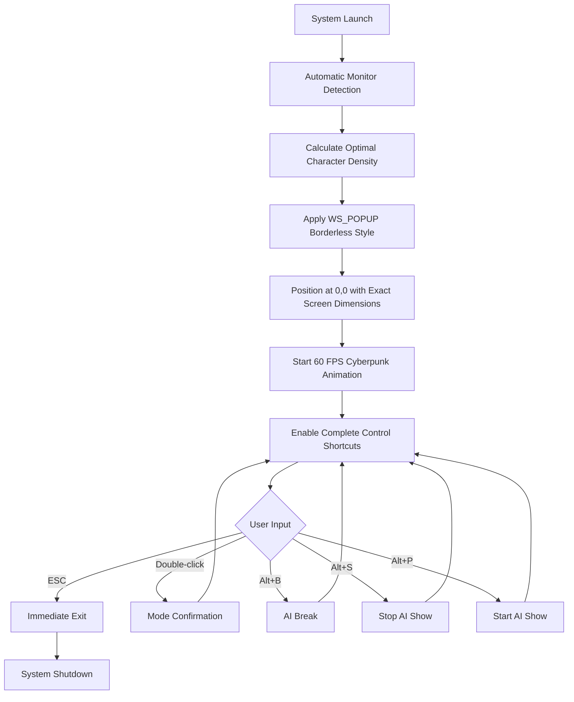
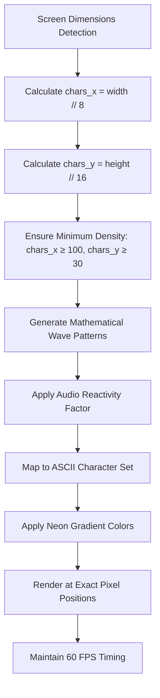

# NeonGlyph Seamless E2E Scaling System - Product Requirements

**Document Type**: Product Requirements Document  
**Version**: 3.0.0  
**Last Updated**: 2025-11-14  
**Status**: Approved  
**Author**: NeonGlyph Development Team  

## 1. Product Overview

NeonGlyph Seamless E2E Scaling System delivers complete borderless implementation that adapts perfectly to any monitor size with zero OS chrome interference. This revolutionary visual synthesis engine provides universal monitor support with automatic detection and adaptation to any display configuration, ensuring perfect pixel coverage with exact screen dimension coverage at 0,0 positioning.

The system targets VJs, streamers, and live coders who demand the ultimate "hacker" aesthetic with seamless 60 FPS ASCII animation powered by mathematical character density calculation and cyberpunk visual system featuring flowing @ symbol patterns with neon gradients and audio reactivity.

## 2. Core Features

### 2.1 User Roles

| Role | Registration Method | Core Permissions |
|------|---------------------|------------------|
| VJ Operator | Automatic upon launch | Full seamless scaling control, AI Director access, psychedelic mode activation |
| Streamer | Automatic upon launch | Borderless mode switching, OBS integration, performance monitoring |
| Live Coder | Automatic upon launch | ASCII purity mode, pure visual mode, keyboard shortcut access |

### 2.2 Feature Module

Our seamless scaling requirements consist of the following main pages/features:

1. **Seamless Window Engine**: Complete borderless implementation, zero OS chrome removal, WS_POPUP style implementation
2. **Universal Monitor Detection**: Automatic monitor detection, multi-display support, resolution adaptation
3. **Perfect Pixel Scaling**: Mathematical character density calculation, aspect ratio preservation, adaptive scaling algorithms
4. **Cyberpunk Visual Generator**: Flowing @ symbol patterns, neon gradient system, audio-reactive animations
5. **Complete Control Interface**: ESC, Double-click, Alt+B/S/P shortcuts for seamless control integration
6. **Performance Management System**: 60 FPS target, <800 draw calls, <2GB memory usage

### 2.3 Page Details

| Page/Feature Name | Module Name | Feature description |
|-------------------|-------------|---------------------|
| Seamless Window Engine | Borderless Implementation | Remove ALL window decorations using WS_POPUP style, implement complete OS chrome removal, achieve zero-border seamless appearance |
| Seamless Window Engine | Window Style Management | Apply WS_POPUP | WS_VISIBLE minimal style, configure WS_EX_TOPMOST | WS_EX_TOOLWINDOW extended styles, hide from taskbar completely |
| Universal Monitor Detection | Monitor Enumeration | Automatically detect all connected displays using GetSystemMetrics, enumerate monitor properties (resolution, refresh rate, aspect ratio) |
| Universal Monitor Detection | Primary Monitor Selection | Identify primary display automatically, support multi-monitor configurations, adapt to any screen size from 1024x768 to 8K |
| Perfect Pixel Scaling | Mathematical Density Calculation | Calculate optimal character density based on screen dimensions, implement chars_x = screen_width // char_width, chars_y = screen_height // char_height |
| Perfect Pixel Scaling | Adaptive Scaling Algorithms | Implement Stretch, AspectRatio, PixelPerfect, and Adaptive scaling modes, maintain 95% screen coverage with small borders |
| Cyberpunk Visual Generator | @ Symbol Pattern Engine | Generate flowing cyberpunk patterns using mathematical wave functions, implement wave1-4 combination algorithms for complex patterns |
| Cyberpunk Visual Generator | Neon Gradient System | Create flowing neon gradients with hue-based color transitions (Cyan→Purple→Green→Cyan), implement brightness variation for depth |
| Cyberpunk Visual Generator | Audio Reactivity Engine | Implement audio_reactivity parameter (0.4-0.7 range), synchronize visual intensity with mathematical audio analysis |
| Complete Control Integration | ESC Key Handler | Implement immediate exit functionality, ensure clean shutdown sequence, maintain responsive user control |
| Complete Control Integration | Double-click Handler | Provide user feedback for seamless mode confirmation, implement toggle functionality between modes |
| Complete Control Integration | Alt+B/S/P Shortcuts | Implement Alt+B (AI Break), Alt+S (Stop AI Show), Alt+P (Start AI Show) for complete AI control |
| Performance Management System | 60 FPS Animation Loop | Implement 0.016ms frame timing (60 FPS), maintain smooth ASCII animation with mathematical character placement |
| Performance Management System | Memory Optimization | Target <2GB baseline memory usage, implement efficient canvas updates with delete("all") and update_idletasks() |

## 3. Core Process

### User Operation Flow

### Seamless Scaling Algorithm Flow

## 4. User Interface Design

### 4.1 Design Style

- **Primary Colors**: Cyberpunk neon palette - Cyan (#00FFFF), Purple (#FF00FF), Green (#00FF00)
- **Secondary Colors**: Deep blacks (#000000) for seamless background, bright highlights (#FFFFFF) for accents
- **Font Style**: Consolas monospace for perfect ASCII rendering, 8-14pt optimal size calculation
- **Layout Style**: Complete borderless implementation, zero OS chrome, perfect pixel coverage
- **Animation Style**: Mathematical wave-based flowing patterns, 60 FPS smooth motion, audio-reactive intensity

### 4.2 Page Design Overview

| Page/Feature | Module | UI Elements |
|--------------|--------|-------------|
| Seamless Window | Borderless Engine | WS_POPUP style, WS_EX_TOPMOST extended style, HWND_TOPMOST positioning, exact screen dimension coverage |
| ASCII Generator | Character Placement | Mathematical position calculation: pixel_x = x * char_width, pixel_y = y * char_height, center anchor positioning |
| Cyberpunk Visuals | Pattern Generation | Wave1-4 mathematical functions, combined intensity calculation, character index mapping to @#S%?*+;:,. |
| Color System | Neon Gradients | Hue-based transitions (0.0-1.0 range), brightness variation (0.6-1.0 range), RGB color calculation |
| Control System | Keyboard Shortcuts | ESC (exit), Double-click (confirmation), Alt+B/S/P (AI control), completely invisible UI |

### 4.3 Responsiveness

- **Desktop-First**: Optimized for desktop VJ applications, complete keyboard control
- **Universal Monitor Support**: Automatic adaptation from 1024x768 to 8K resolutions
- **Performance Scaling**: Dynamic quality adjustment based on system capabilities
- **Touch Interaction**: Not applicable - keyboard and mouse-based control system

## 5. Technical Specifications

### 5.1 Performance Requirements

- **Frame Rate**: 60 FPS minimum (0.016ms frame timing)
- **Memory Usage**: <2GB baseline allocation
- **CPU Usage**: <5% on modern processors
- **Draw Calls**: <800 per frame
- **Latency**: <16ms audio-to-visual response

### 5.2 Compatibility Requirements

- **Operating System**: Windows 10/11 with WS_POPUP support
- **Graphics**: Direct2D compatible, Vulkan optional
- **Audio**: WASAPI loopback capture support
- **Display**: Any monitor from 1024x768 to 7680x4320 (8K)
- **Input**: Standard keyboard with Alt key combinations

### 5.3 Scaling Algorithms

- **Stretch Mode**: Fill entire screen (may distort aspect ratio)
- **AspectRatio Mode**: Maintain aspect ratio with letterboxing
- **PixelPerfect Mode**: Integer scaling only (no fractional scaling)
- **Adaptive Mode**: Smart scaling with 95% screen coverage

## 6. Safety and Quality Standards

### 6.1 Epilepsy Protection

- **Flash Rate Limitation**: Maximum 3 flashes per second
- **Luminance Clamping**: Rolling average luminance delta control
- **Color Safety**: Photosensitive color filtering
- **Transition Smoothing**: 0.2-0.5 second transition durations

### 6.2 Performance Safety

- **Automatic Fallback**: Quality reduction under performance stress
- **Memory Monitoring**: <4GB emergency threshold
- **CPU Throttling**: <25% emergency threshold
- **GPU Memory**: <6GB emergency threshold

## 7. Future Enhancements

### 7.1 Advanced Scaling Features

- **Multi-Monitor Spanning**: Cross-monitor seamless scaling
- **Dynamic Resolution**: Real-time resolution switching
- **VR Integration**: 3D ASCII environments with seamless scaling
- **AI-Optimized Scaling**: Machine learning-based density calculation

### 7.2 Enhanced Visual Systems

- **Advanced Cyberpunk Effects**: Holographic projections, glitch aesthetics
- **Real-Time Ray Tracing**: ASCII-based ray tracing for enhanced depth
- **Particle Systems**: ASCII particle effects with seamless integration
- **Advanced Audio Reactivity**: Frequency-specific visual responses