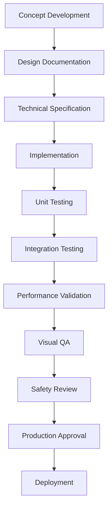

# NeonGlyph Production Standards

**Document Type**: Production Standards
**Version**: 2.0.0
**Last Updated**: 2025-11-13
**Status**: Approved
**Author**: NeonGlyph Development Team

## Overview

This document establishes comprehensive production standards for AI agents developing themes and effects for the NeonGlyph ASCII VJ system. These standards ensure consistent quality, performance, and maintainability across all visual components.

## 1. Production Documentation Template

### 1.1 Theme Development Documentation Structure

Every theme must include the following documentation sections:

```markdown
# [Theme Name] - Production Documentation

## 1. Theme Overview
- **Theme Name**: [Official Name]
- **Theme ID**: [Unique Identifier]
- **Version**: [Semantic Version]
- **Author**: [Developer/Team Name]
- **Created Date**: [YYYY-MM-DD]
- **Last Modified**: [YYYY-MM-DD]
- **Status**: [Development/Testing/Production/Deprecated]

## 2. Narrative Core
- **Target Audience**: [Primary user demographic]
- **Visual Objective**: [What users should experience]
- **Key Message**: [Core aesthetic/functional goal]
- **Tone**: [3-word description, e.g., "Cyberpunk · Intense · Reactive"]

## 3. Technical Specifications
- **Resolution Support**: [Supported resolutions]
- **Frame Rate Target**: [FPS target]
- **Performance Budget**: [CPU/GPU/Memory limits]
- **Compatibility**: [System requirements]

## 4. Visual Design Guidelines
- **Color Palette**: [Primary/Secondary/Accent colors]
- **Character Set**: [ASCII characters used]
- **Composition Rules**: [Layout principles]
- **Animation Principles**: [Timing/spacing guidelines]

## 5. Implementation Notes
- **Algorithm Description**: [Technical approach]
- **Dependencies**: [External libraries/requirements]
- **Configuration Options**: [Customizable parameters]
- **Known Limitations**: [Technical constraints]

## 6. Quality Assurance
- **Test Procedures**: [Validation methods]
- **Performance Metrics**: [Benchmarking criteria]
- **Visual Consistency Checks**: [Quality gates]
- **Safety Validation**: [Epilepsy/content filtering]

## 7. Deployment Instructions
- **Installation Process**: [Setup steps]
- **Configuration**: [Parameter tuning]
- **Testing Protocol**: [Validation steps]
- **Rollback Procedure**: [Reversion process]
```

### 1.2 Documentation Quality Standards

- **Completeness**: All sections must be filled with relevant information
- **Accuracy**: Technical specifications must match implementation
- **Clarity**: Language must be accessible to other developers
- **Consistency**: Follow established terminology and formatting
- **Version Control**: Documentation must be updated with code changes

## 2. Theme Development Workflow

### 2.1 Development Pipeline



### 2.2 Phase Definitions

#### Phase 1: Concept Development (1-2 days)
- **Activities**: Market research, user needs analysis, creative exploration
- **Deliverables**: Concept document, mood board, initial sketches
- **Approval Gate**: Concept review with production team
- **Handoff**: Approved concept to design team

#### Phase 2: Design Documentation (2-3 days)
- **Activities**: Visual design, technical architecture, specification writing
- **Deliverables**: Complete production documentation, technical specs
- **Approval Gate**: Design review with technical lead
- **Handoff**: Approved design to development team

#### Phase 3: Implementation (5-10 days)
- **Activities**: Code development, algorithm implementation, optimization
- **Deliverables**: Working theme, unit tests, performance benchmarks
- **Approval Gate**: Code review with senior developer
- **Handoff**: Implemented theme to QA team

#### Phase 4: Testing & Validation (3-5 days)
- **Activities**: Functional testing, performance testing, visual QA
- **Deliverables**: Test reports, performance metrics, QA sign-off
- **Approval Gate**: QA review with production owner
- **Handoff**: Validated theme to deployment team

#### Phase 5: Production Deployment (1-2 days)
- **Activities**: Final review, documentation update, deployment preparation
- **Deliverables**: Production-ready theme, updated documentation
- **Approval Gate**: Final production approval
- **Handoff**: Deployed theme to operations team

### 2.3 Review Cycles

#### Weekly Review Meetings
- **Participants**: Development team, QA team, production manager
- **Agenda**: Progress review, issue resolution, resource allocation
- **Duration**: 30-45 minutes
- **Output**: Updated project status, action items

#### Milestone Reviews
- **Trigger**: Completion of major development phases
- **Participants**: All stakeholders
- **Focus**: Quality gates, go/no-go decisions
- **Duration**: 1-2 hours
- **Output**: Formal approval/rejection decisions

## 3. Visual Language Standards

### 3.1 ASCII Art Design Principles

#### Character Density Guidelines
- **High Density**: `@%#*+=-:. ` (10 characters) for detailed scenes
- **Medium Density**: `@#*=-. ` (7 characters) for balanced detail
- **Low Density**: `@#-. ` (4 characters) for minimalist designs
- **Specialized Sets**: Custom characters for specific effects

#### Composition Rules
- **Rule of Thirds**: Key visual elements at intersection points
- **Visual Hierarchy**: Primary, secondary, tertiary element emphasis
- **Negative Space**: 20-40% empty space for visual breathing room
- **Reading Flow**: Left-to-right, top-to-bottom for Western audiences

#### Animation Timing Standards
- **Beat Synchronization**: Visual changes on musical beats (120-140 BPM typical)
- **Transition Duration**: 0.2-0.5 seconds for smooth morphing
- **Hold Times**: 0.5-2.0 seconds for readable content display
- **Flash Prevention**: Maximum 3 flashes per second for safety

### 3.2 Color Palette Standards

#### Cyberpunk Theme
```json
{
  "primary": "#00ff00",
  "secondary": "#ff0080", 
  "accent": "#00ffff",
  "background": "#0a0a0a",
  "highlight": "#ffffff"
}
```

#### Vaporwave Theme
```json
{
  "primary": "#ff71ce",
  "secondary": "#01cdf4",
  "accent": "#05ffa1",
  "background": "#1a1a2e",
  "highlight": "#f9f871"
}
```

#### Matrix Theme
```json
{
  "primary": "#00ff41",
  "secondary": "#008f11",
  "accent": "#003008",
  "background": "#000000",
  "highlight": "#7fff00"
}
```

### 3.3 AI-Generated Visual Content Guidelines

#### AI Conductor Integration
- **Musical Analysis**: LLM analyzes audio to determine genre, tempo, mood, and energy
- **Scene Generation**: AI generates contextual visual descriptions based on musical analysis
- **Real-Time Adaptation**: Visuals adapt dynamically to changing musical characteristics
- **Safety Filtering**: All AI-generated content must pass epilepsy and NSFW validation

#### AI Content Standards
- **Relevance**: Generated visuals must align with detected musical properties
- **Coherence**: Visual transitions must maintain thematic consistency
- **Performance**: AI-generated scenes must meet performance budgets
- **Originality**: AI content should enhance rather than replace human creativity
- **Seamless Integration**: AI content must work with borderless scaling system
- **Character Density**: AI-generated ASCII must respect mathematical density calculations

#### AI Scene Description Format
```json
{
  "scene_type": "ambient_reactive",
  "primary_elements": ["flowing_waves", "pulsing_grid"],
  "color_palette": {"primary": "#00ff00", "secondary": "#0080ff"},
  "animation_speed": "medium",
  "complexity_level": "balanced",
  "musical_alignment": "tempo_synchronized"
}
```

### 3.4 Technical Specifications

#### Resolution Standards
- **Minimum**: 1920x1080 (Full HD)
- **Target**: 3840x2160 (4K)
- **Maximum**: 7680x4320 (8K)
- **Aspect Ratio**: 16:9 standard, 21:9 ultrawide support

#### Performance Requirements
- **Frame Rate**: 144 FPS target (TARGET_FPS constant) / 60 FPS for seamless scaling
- **Latency**: <12ms audio-to-visual response (AI Conductor maxLatencyMs)
- **CPU Usage**: <5% on modern processors
- **Memory**: <2GB baseline allocation
- **GPU Memory**: <4GB for 4K rendering / <2GB for seamless scaling
- **Audio Sample Rate**: 48kHz (MAX_AUDIO_SAMPLE_RATE)
- **Maximum Texture Size**: 8192x8192 (MAX_TEXTURE_SIZE constant)
- **Seamless Scaling**: <2ms window creation, <1ms mode switching
- **Character Density**: Minimum 100x30 characters for optimal ASCII rendering
- **Borderless Performance**: WS_POPUP implementation with zero OS chrome overhead

## 4. Quality Assurance Framework

### 4.1 Multi-Stage Quality Gates

#### Gate 1: Technical Validation
- **Automated Testing**: Unit tests, integration tests, AI Conductor validation
- **Performance Benchmarking**: Frame rate, latency, resource usage, AI latency
- **Compatibility Testing**: Multiple hardware configurations, ONNX Runtime validation
- **Security Review**: Input validation, resource limits, LLM content safety
- **Criteria**: 95% test coverage, <12ms latency, <800 draw calls, AI Conductor response <1000ms

#### Gate 2: Visual Quality Review
- **Aesthetic Consistency**: Theme adherence, visual harmony
- **Animation Quality**: Smoothness, timing, responsiveness
- **Readability**: Character clarity, contrast ratios
- **Artistic Merit**: Creative expression, user appeal
- **Criteria**: 8/10 aesthetic rating, smooth animations, clear visuals

#### Gate 3: Safety Validation
- **Epilepsy Protection**: Flash frequency analysis
- **Content Filtering**: NSFW detection, appropriateness
- **Performance Safety**: Resource usage limits
- **Accessibility**: Color blindness compatibility
- **Criteria**: <3 flashes/second, safe content, accessible design

#### Gate 4: User Experience Testing
- **Usability Testing**: User feedback, ease of use
- **Performance Perception**: Subjective responsiveness
- **Visual Appeal**: User preference ratings
- **Integration Testing**: Compatibility with VJ workflows
- **Criteria**: 80% positive user feedback, seamless integration

### 4.2 Automated Testing Protocols

#### Visual Regression Testing
```cpp
class VisualRegressionTester {
public:
    bool CompareFrames(const FrameData& reference, const FrameData& current);
    float CalculateSimilarityScore(const FrameData& a, const FrameData& b);
    bool DetectVisualAnomalies(const FrameData& frame);
    void GenerateDifferenceReport(const FrameData& reference, const FrameData& current);
};
```

#### Performance Benchmarking
```cpp
class PerformanceBenchmark {
public:
    void RunFrameRateTest(int duration_seconds);
    void MeasureLatencyTest();
    void ProfileResourceUsage();
    void StressTest(int complexity_level);
    BenchmarkReport GenerateReport();
};
```

## 5. Performance Management System

### 5.1 Automated Benchmarking Tools

#### Real-Time Performance Monitoring
```cpp
class PerformanceMonitor {
private:
    std::chrono::steady_clock::time_point last_frame_time;
    std::vector<float> frame_time_history;
    float average_fps;
    float latency_ms;
    
public:
    void RecordFrameTime();
    void UpdateMetrics();
    PerformanceReport GetCurrentMetrics();
    bool IsPerformanceAcceptable();
    void LogPerformanceData();
};
```

#### Resource Usage Tracking
```cpp
class ResourceTracker {
private:
    size_t peak_memory_usage;
    float max_cpu_usage;
    int gpu_memory_peak;
    
public:
    void MonitorMemoryUsage();
    void TrackCPUUtilization();
    void MeasureGPUMemory();
    ResourceReport GetResourceReport();
    bool AreResourcesWithinLimits();
};
```

### 5.2 Performance Thresholds

#### Critical Thresholds (Must Not Exceed)
- **Frame Rate**: Minimum 60 FPS (emergency fallback)
- **Latency**: Maximum 32ms (emergency threshold)
- **AI Conductor Latency**: Maximum 1000ms
- **Memory**: Maximum 4GB
- **CPU**: Maximum 25%
- **GPU Memory**: Maximum 6GB
- **Audio Latency**: Maximum 50ms

#### Target Thresholds (Should Achieve)
- **Frame Rate**: Target 144 FPS
- **Latency**: Target <12ms (AI Conductor maxLatencyMs)
- **AI Conductor Response**: Target <500ms
- **Memory**: Target <2GB
- **CPU**: Target <5%
- **GPU Memory**: Target <4GB

#### Optimal Thresholds (Strive For)
- **Frame Rate**: Optimal 144 FPS
- **Latency**: Optimal <8ms
- **AI Conductor Response**: Optimal <250ms
- **Memory**: Optimal <1GB
- **CPU**: Optimal <2%
- **GPU Memory**: Optimal <2GB
- **Audio Processing**: Optimal <5ms latency

## 6. Visual Consistency Checks

### 6.1 Automated Validation Tools

#### Theme Consistency Validator
```cpp
class ThemeConsistencyValidator {
public:
    bool ValidateColorPalette(const Theme& theme);
    bool ValidateCharacterSet(const Theme& theme);
    bool ValidateAnimationTiming(const Theme& theme);
    bool ValidateCompositionRules(const Theme& theme);
    ValidationReport GenerateValidationReport(const Theme& theme);
};
```

#### Cross-Theme Comparison System
```cpp
class CrossThemeComparator {
public:
    float CalculateVisualSimilarity(const Theme& a, const Theme& b);
    std::vector<SimilarityIssue> FindSimilarityIssues(const Theme& theme);
    bool IsThemeSufficientlyUnique(const Theme& new_theme, const std::vector<Theme>& existing);
    void GenerateDiversityReport(const std::vector<Theme>& themes);
};
```

### 6.2 Visual Regression Testing

#### Automated Screenshot Comparison
- **Reference Images**: Baseline screenshots for each theme
- **Current Capture**: Real-time screenshot capture during testing
- **Difference Detection**: Pixel-by-pixel comparison algorithms
- **Threshold Settings**: Acceptable variance levels (typically 1-2%)
- **Report Generation**: Detailed difference reports with visualizations

#### Animation Consistency Checks
- **Frame Sequence Validation**: Ensure smooth transitions
- **Timing Consistency**: Verify animation durations
- **Color Transition Smoothness**: Check for jarring color changes
- **Character Placement Accuracy**: Validate ASCII positioning

## 7. Version Control Implementation

### 7.1 Git-Based Version Control System

#### Repository Structure
```
themes/
├── active/
│   ├── cyberpunk/
│   │   ├── v1.0.0/
│   │   ├── v1.1.0/
│   │   └── v2.0.0/
│   └── vaporwave/
│       └── v1.0.0/
├── development/
│   ├── feature/
│   │   ├── cyberpunk-night/
│   │   └── matrix-evolved/
│   └── experimental/
│       └── ascii-fluid/
└── archive/
    └── deprecated/
```

#### Branching Strategy
- **main**: Production-ready themes only
- **develop**: Integration branch for new features
- **feature/***: Individual feature development
- **hotfix/***: Critical bug fixes
- **release/***: Release preparation

### 7.2 Version Management

#### Semantic Versioning
- **MAJOR**: Breaking changes, major redesigns
- **MINOR**: New features, backward compatible
- **PATCH**: Bug fixes, minor adjustments

#### Version History Tracking
```cpp
struct VersionHistory {
    std::string version;
    std::string date;
    std::string author;
    std::vector<std::string> changes;
    std::string approval_status;
    std::vector<std::string> test_results;
};
```

## 8. AI Conductor Integration Standards

### 8.1 LLM Integration Requirements

#### AI Conductor Configuration Standards
- **Endpoint Validation**: Must validate Ollama endpoint connectivity
- **Model Specification**: Default to "llama3.2:3b" or user-specified model
- **Latency Requirements**: Maximum 1000ms response time, target <500ms
- **Content Safety**: All LLM outputs must pass NSFW and epilepsy filtering
- **Fallback Behavior**: Graceful degradation when AI Conductor is unavailable

#### Musical Analysis Standards
```cpp
struct AIMusicalAnalysis {
    std::string genre_classification;
    float tempo_bpm;
    std::string mood_description;
    std::string energy_level;  // "low", "medium", "high"
    std::vector<std::string> recommended_visual_elements;
    std::string scene_generation_prompt;
    float confidence_score;
};
```

#### Scene Generation Guidelines
- **Context Awareness**: Analysis must consider current visual theme
- **Beat Synchronization**: Generated scenes must align with detected tempo
- **Visual Coherence**: New scenes must transition smoothly from existing visuals
- **Performance Consideration**: Generated scenes must meet performance budgets
- **Safety Compliance**: All generated content must pass safety validation

### 8.2 AI Content Validation

#### Content Safety Pipeline
```cpp
class AIContentValidator {
public:
    bool ValidateMusicalAnalysis(const AIMusicalAnalysis& analysis);
    bool ValidateScenePrompt(const std::string& prompt);
    bool CheckForEpilepsyTriggers(const std::string& scene_description);
    bool ValidateNSFWContent(const std::string& content);
    ValidationReport GenerateContentReport();
};
```

#### Real-Time AI Integration
- **Asynchronous Processing**: AI analysis must not block rendering thread
- **Callback System**: Results delivered via safe callback mechanism
- **Queue Management**: Pending AI requests must be managed efficiently
- **Timeout Handling**: Requests exceeding 1000ms must be cancelled
- **Error Recovery**: Failed AI requests must not crash the application

### 8.3 AI Performance Monitoring

#### AI Conductor Metrics
```cpp
struct AIConductorMetrics {
    float average_response_time_ms;
    int successful_requests;
    int failed_requests;
    float success_rate;
    std::string current_model;
    bool is_healthy;
    std::vector<float> response_time_history;
};
```

#### Health Monitoring
- **Connection Health**: Continuous monitoring of LLM endpoint availability
- **Response Quality**: Tracking of analysis accuracy and relevance
- **Performance Impact**: Monitoring AI overhead on overall system performance
- **Fallback Activation**: Automatic switching to non-AI modes when needed

## 9. Naming Conventions

### 9.1 Standardized Naming Structure

#### Theme Naming Convention
```
[category]_[style]_[variant]_[version]
```
Examples:
- `cyberpunk_neon_v1.0.0`
- `vaporwave_retro_v1.2.0`
- `matrix_classic_v2.1.0`

#### Effect Naming Convention
```
[theme]_[effect_type]_[intensity]_[variant]
```
Examples:
- `cyberpunk_strobe_high_pulse`
- `vaporwave_wave_medium_smooth`
- `matrix_rain_low_dense`

### 9.2 Taxonomy System

#### Theme Categories
- **Cyberpunk**: High-tech, low-life aesthetic
- **Vaporwave**: Retro, nostalgic, pastel colors
- **Matrix**: Green code, digital rain
- **Noir**: Monochrome, high contrast
- **Glitch**: Digital artifacts, distortion
- **Minimal**: Clean, simple, geometric
- **AI-Generated**: LLM-conceived themes with unique characteristics
- **Reactive**: AI Conductor-driven adaptive themes

#### Effect Types
- **Ambient**: Background, atmospheric
- **Reactive**: Audio-responsive
- **Transitional**: Scene changes
- **Accent**: Highlight elements
- **Text**: Typography effects

## 10. Performance Optimization

### 10.1 Performance Tracking System

#### Automated Performance Profiling
```cpp
class PerformanceProfiler {
public:
    void StartProfiling();
    void EndProfiling();
    PerformanceReport AnalyzePerformance();
    std::vector<Bottleneck> IdentifyBottlenecks();
    OptimizationSuggestions GenerateOptimizationSuggestions();
};
```

#### Resource Budget Management
```cpp
struct ResourceBudget {
    int max_draw_calls = 800;
    int max_memory_mb = 2048;
    float max_cpu_usage = 0.05f;
    int max_gpu_memory_mb = 4096;
    float target_fps = 144.0f;  // TARGET_FPS constant
    float max_latency_ms = 12.0f;  // AI Conductor maxLatencyMs
    float max_ai_conductor_latency_ms = 1000.0f;
    int max_audio_sample_rate = 48000;  // MAX_AUDIO_SAMPLE_RATE
};
```

### 10.2 Optimization Guidelines

#### CPU Optimization
- **Algorithm Efficiency**: O(n log n) or better complexity
- **Memory Access**: Cache-friendly data structures
- **Parallel Processing**: Multi-threading for AI Conductor and audio processing
- **Early Exit**: Conditional processing optimization
- **AI Conductor**: Asynchronous LLM processing with callback system
- **Audio Processing**: AVRT thread priority for low-latency audio

#### GPU Optimization
- **Batch Operations**: Minimize draw calls (<800 target)
- **Texture Atlasing**: Reduce texture switches
- **Shader Efficiency**: Optimize Vulkan compute shaders
- **Memory Management**: Efficient buffer usage for 8K textures
- **ASCII Canvas**: Dynamic resizing based on performance
- **FreeType Integration**: Efficient font atlas management

## 11. Live Performance Systems

### 11.1 Automated Fallback Mechanisms

#### Performance Degradation Detection
```cpp
class PerformanceFallback {
public:
    void MonitorPerformance();
    bool IsPerformanceDegraded();
    void TriggerFallbackMeasures();
    void ReduceQualityLevel();
    void DisableNonEssentialEffects();
    void RestoreNormalOperation();
};
```

#### Fallback Quality Levels
1. **Level 0 (Normal)**: Full effects, AI Conductor active, maximum quality
2. **Level 1 (Reduced)**: Simplified effects, AI Conductor active, 75% quality
3. **Level 2 (Minimal)**: Basic effects, AI Conductor disabled, 50% quality
4. **Level 3 (Emergency)**: Core functionality only, AI systems disabled

### 11.2 Pre-Show Checklist System

#### Automated System Validation
```cpp
class PreShowValidator {
public:
    bool ValidateSystemResources();
    bool TestAudioInput();
    bool VerifyOutputConnections();
    bool CheckThemeIntegrity();
    bool ValidateSafetySystems();
    bool ValidateAIConductorConnection();  // LLM endpoint validation
    bool ValidateONNXRuntime();  // AI Director validation
    ValidationReport GeneratePreShowReport();
};
```

#### Calibration Procedures
- **Audio Calibration**: Input levels, frequency response, 48kHz sampling
- **Visual Calibration**: Brightness, contrast, color accuracy, 8K resolution
- **Performance Calibration**: Frame timing, latency measurement, 144 FPS target
- **Safety Calibration**: Flash detection, content filtering, epilepsy protection
- **AI Calibration**: LLM response time, content safety validation
- **Network Calibration**: AI Conductor endpoint connectivity

### 11.3 Real-Time Monitoring

#### Live Performance Dashboard
```cpp
class LivePerformanceMonitor {
public:
    void StartMonitoring();
    void UpdateMetrics();
    void CheckThresholds();
    void AlertOperators();
    void LogPerformanceData();
    void GenerateLiveReport();
};
```

#### Adaptive Performance Management
- **Real-Time Adjustment**: Dynamic quality scaling
- **Predictive Optimization**: Anticipate performance needs
- **Emergency Response**: Immediate fallback activation
- **Recovery Procedures**: Gradual return to normal operation

## Implementation Priority

### Phase 1 (Immediate - 1-2 weeks)
1. Production Documentation Template with AI Conductor requirements
2. Naming Conventions including AI-generated content
3. Basic Quality Gates with LLM integration standards
4. Version Control Setup with ONNX model management

### Phase 2 (Short-term - 2-4 weeks)
1. Theme Development Workflow with AI integration
2. Visual Language Standards with LLM content guidelines
3. Automated Testing Framework including AI validation
4. Performance Monitoring with AI Conductor metrics

### Phase 3 (Medium-term - 1-2 months)
1. Visual Consistency Checks with AI content validation
2. Advanced QA Framework including LLM response validation
3. Performance Optimization for 144 FPS with AI systems
4. Live Performance Systems with AI Conductor fallback

### Phase 4 (Long-term - 2-3 months)
1. Comprehensive Performance Management with AI optimization
2. Advanced Fallback Systems including AI Conductor failover
3. Predictive Optimization using machine learning
4. Full Automation with intelligent quality adaptation

## Change Management

### Version Control
- All changes must be documented and approved
- Breaking changes require major version increment
- New features require minor version increment
- Bug fixes require patch version increment

### Approval Process
1. Developer submits change request
2. Technical review by senior developer
3. QA validation and testing
4. Production owner approval
5. Deployment and monitoring

This production standards document serves as the foundation for all AI agent development activities within the NeonGlyph ecosystem, ensuring consistent quality and performance across all themes and effects.
*** End of File